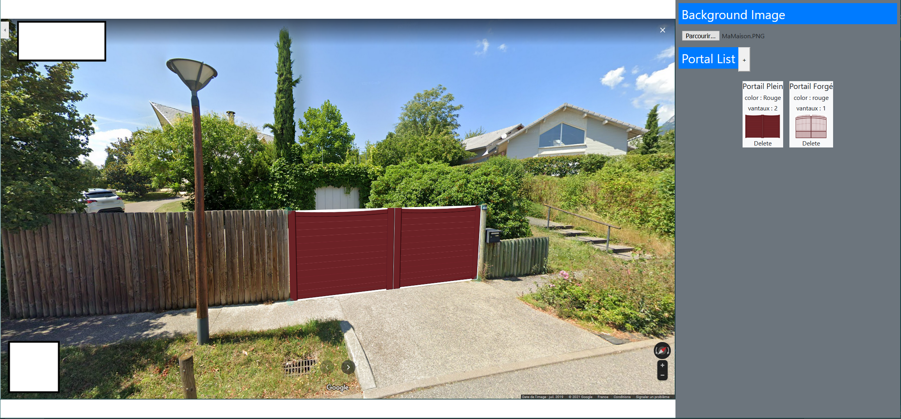

# Requirement
###MongoDb DataBase 
* "Situation" Database
* "portals" Collection
### Package NPM

`npm install`

* Axio
* VueJs
* Express
* Bootstrap
* mongodb
#Briefing
Pour utiliser la mise en situation, on ajoute une photo de l'entrée de son habitation , puis autant de portail que l'on veut
On peut ensuite s'amuser à déformer et déplacer le portail pour le faire visuellement correspondre à l'entrée.

### Help 

Le repository Git contient les images pour tester le fonctionnement -> TestImages 

Attention Seul l'exemple 2 et 3 des portails sont acceptés -> J'utilise une conversion en DataUrl pour stocker les images en bases de données, ce n'est pas viable car les limites par défauts d'upload sont vites atteintes (< 100ko)

le jeu de test ne contient pas de portails transparent ce qui serait visuellement mieux

Pour sélectionner le portail à afficher, bien cliquer sur la preview dans la liste 
